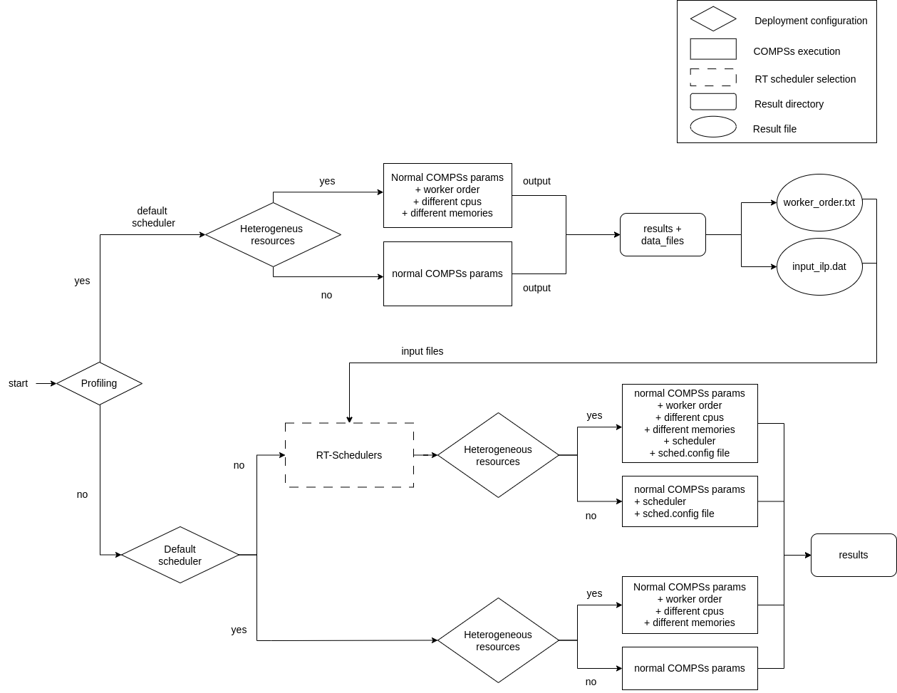

# Executing an application using COMPSs framework 

An application can be launched using the COMPSs framework in different deployments, specifically in Kubernetes or Docker Swarm architectures.

The following image depicts the different COMPSs execution options:


## Executing an application using COMPSs framework in Kubernetes

To execute an application using the COMPSs framework in Kubernetes, you can run the `runcompss-k8s` command.

If you have COMPSs already built in an image or from the source (i.e., COMPSs installed on your local machine, not in a Docker image), use the following command:

```
runcompss-k8s 
```

If COMPSs is not already built, you can use the script located in `compss/runtime/scripts/user`:

```
cd path_to_script
./runcompss-k8s 
```

### Command Line Flags for runcompss-k8s

#### Mandatory Arguments

- `--w`, `--worker-pods`:  
  Specify the number of worker containers the app will execute on. One more container will be created to host the master.  
  **Example:** `--worker-pods=2`

- `--i`, `--image-name`:  
  Specify the image name of the application image in Dockerhub. Remember you must generate this with `runcompss-docker-gen-image`. The format must be: `"DOCKERHUB_USERNAME/APP_IMAGE_NAME:TAG"` (the `:TAG` is optional).  
  **Example:** `--image-name='john123/my-compss-application:1.9'`

- `--c`, `--context-dir`:  
  Specify the absolute application context directory inside the image. When using an application image, its provider must give you this information.  
  **Example:** `--context-dir='/home/compss-user/my-app-dir'`

#### Optional Arguments

- `--c-cpu-units`:  
  Specify the number of CPU units used by each container (**default**: `2` computing units).  
  **Example:** `--c-cpu-units=16`

- `--c-memory`:  
  Specify the physical memory used by each container in GB (**default**: `4` GB).  
  **Example:** `--c-memory=32`  # (each container will use 32 GB)

- `--c-creation-time`:  
  Time required to create a Kubernetes Pod (**default**: `60` sec).  
  **Example:** `--c-creation-time=12`

- `--c-elasticity`:  
  Number of worker Pods to run in cloud mode (**default**: `0` pods).  
  **Example:** `--c-elasticity=2`

- `--profiling-mode`:  
  Set the execution in profiling mode to capture application data to apply further heuristics (**default**: `false`).  
  **Example:** `--profiling-mode=true` or `--profiling-mode=false`

- `--worker-order`:  
  Order in which workers will be executed to do the profiling or use heuristics.  
  **Example:** `--worker-order="hostname1 hostname2 hostname3"`

## Executing an application using COMPSs framework in Docker Swarm

Executing an application using the COMPSs framework in Docker Swarm is similar to the Kubernetes execution, with the only difference being the script used to launch it.

If you have COMPSs already built in an image or from the source (i.e., COMPSs installed on your local machine, not in a Docker image), use the following command:

```
runcompss-docker 
```

If COMPSs is not already built, you can use the script located in `compss/runtime/scripts/user`:

```
cd path_to_script
./runcompss-docker 
```

## Retrieving the results from profiling execution

All the results will be located in two different folders, as shown in the figure (Figure 1). The `yaml` folder generated is only for showing the configuration for the deployment launch and for debugging purposes.

These two folders are:
*   `results`: This folder contains the output generated from the execution of the application, including logs generated by the application and the content of the application launched. Inside the `results` folder, there will be subfolders for each node set to compute the application, such as the `iperf3` folder used to obtain the network bandwidth.

*   `data_files`: This folder contains necessary files to execute the application using the **RT-schedulers**. It has two different files:
    *   `input_ilp.dat`: Contains the characterization of the environment and the application.
    *   `worker_order.txt`: Contains the order/structure followed for the profiling execution.

## Retrieving the results from normal execution (no profiling)

All the results will be located in one folder, as shown in the figure (Figure 1). The `yaml` folder generated is only for showing the configuration for the deployment launch and for debugging purposes.

This folder is:
*   `results`: This folder contains the output generated from the execution of the application, including logs generated by the application and the content of the application launched.